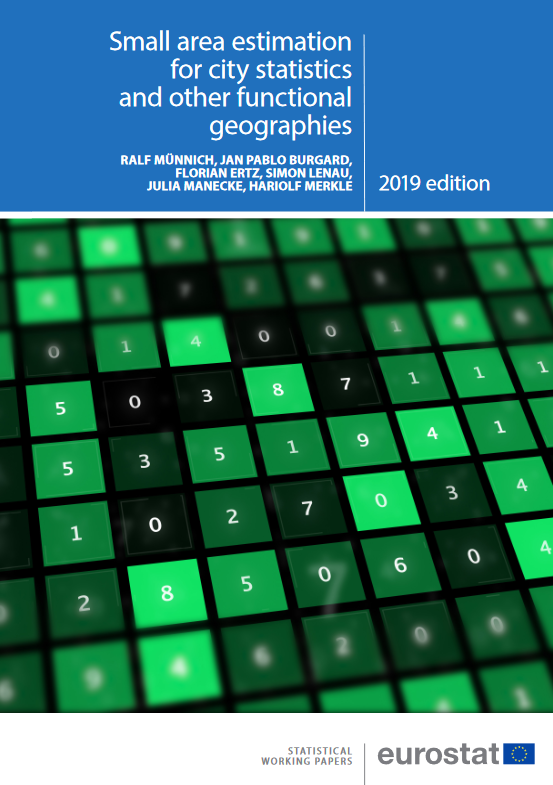

SAE_citystat
=========

Experimental tools for Small Area Estimation (SAE) for city statistics and other functional areas.
---

The material provided herein will enable you to reproduce the experiments presented in _Eurostat_ statistical working paper on [**Small area estimation for city statistics and other functional geographies**](https://ec.europa.eu/eurostat/web/products-statistical-working-papers/-/KS-TC-19-006) (_cite this source code or the reference's doi: [10.2785/898627](http://dx.doi.org/10.2785/898627)_). Further details see the in the working paper ([below](#References)).

**Description**

The source code is provided *as is* in the [**_r_code/_**](r_code) folder so as to repeat the simulation. The code installs the required packages if it is not available. It also prompts and downloads the AMELIA dataset version 0.2.3 which was used in the working paper. 

It is important that the codes (numbered from 00_... through 05_... and performing individual steps of the simulation) including the contained subfolder [**_r_code/Functions_**](r_code/Functions) are kept together in one single folder.

**Usage**

The whole simulation starts from the first script ([**_r_code/00_MAIN.R_**](r_code/00_MAIN.R)). It contains an interactive routing of the user through the whole procedure. Along the way, the user is asked whether she/he wishes to download the AMELIA dataset from the respective website. Also the code can be run as batch script in this case the data automatically downloaded if has not been previously and the default 20 iteraration is done in this case. 

The codes contain numerous comments that should be really useful and the user will receive additional information in dialogue. Following all given the instructions, the complete simulation can be run.

ATTENTION:
You have to take into account computation time, though. The simulation in the working paper was done on a large server infrastructure with approximately 1,200 cores. Reproducing the whole simulation study on just one computer will take many (!) days. Accordingly, it is recommended that the routine is just tested with a few simulation runs (default 20). This should suffice to get a grasp of the general procedure. Obviously, the results reached after only 20 simulation runs will not be the same as the final results given in the respective papers (which are based on many more simulation runs).

**About**

<table align="center">
    <tr>     <td  rowspan="4" align="center" width="140px"> <a href="https://ec.europa.eu/eurostat/documents/3888793/10167512/KS-TC-19-006-EN-N.pdf"></img></a></td>
<td align="left"><i>authors</i></td> <td align="left"> Münnich R., Burgard J. B., Ertz F., Lenau S., Manecke J., and Merkle H.</td> </tr> 
    <tr> <td align="left"><i>version</i></td> <td align="left">1.0</td> </tr> 
    <tr> <td align="left"><i>status</i></td> <td align="left">2019 &ndash; <b>closed</b></td> </tr> 
    <tr> <td align="left"><i>license</i></td> <td align="left"><a href="https://joinup.ec.europa.eu/sites/default/files/custom-page/attachment/eupl_v1.2_en.pdf">EUPL</a> <i>(cite the source code or the reference above!)</i></td> </tr> 
</table>

**References** 

* Münnich R., Burgard J. B., Ertz F., Lenau S., Manecke J., and Merkle H (2019): [[**Small area estimation for city statistics and other functional geographies**](https://ec.europa.eu/eurostat/web/products-statistical-working-papers/-/KS-TC-19-006), _Eurostat_ Statistical Working Paper KS-TC-19-006-EN, doi: [10.2785/898627](http://dx.doi.org/10.2785/898627).

